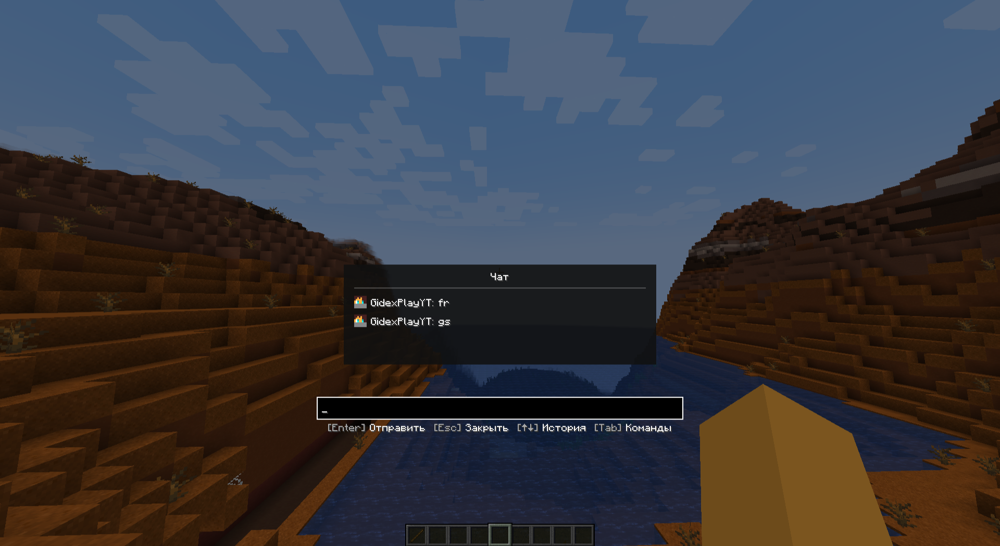
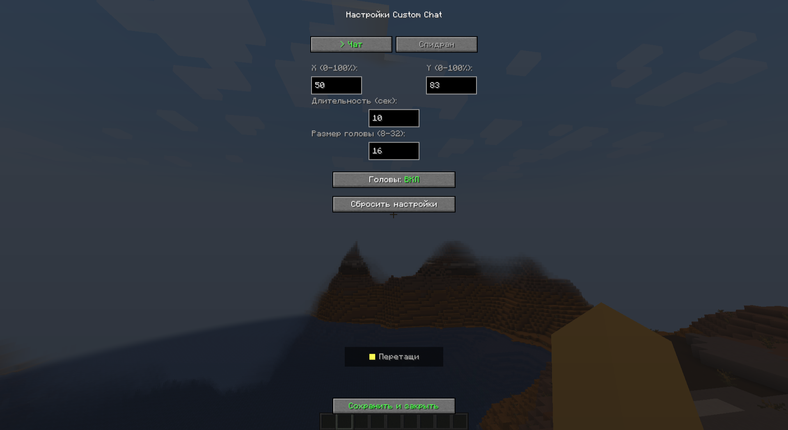

# Custom Chat Mod

Кастомный чат для Minecraft 1.19.2 Forge с расширенными возможностями.

## 📋 Особенности

- ✅ Чат по центру экрана
- ✅ Головы игроков рядом с сообщениями
- ✅ Цветные ники для NPC
- ✅ Кастомный ник в чате
- ✅ Изменение цвета своего ника
- ✅ Динамическая ширина окна чата
- ✅ Команда `/clearchat` для очистки
- ✅ Только последнее сообщение показывается

## 🎮 Команды

| Команда | Описание |
|---------|----------|
| `/chatname <ник>` | Установить кастомный ник в чате |
| `/chatname reset` | Сбросить ник на стандартный |
| `/chatcolor <цвет>` | Изменить цвет своего ника |
| `/clearchat` | Очистить историю чата |

## 🎨 Доступные цвета

`red`, `dark_red`, `blue`, `aqua`, `green`, `dark_green`, `yellow`, `gold`, `purple`, `light_purple`, `gray`, `dark_gray`, `white`, `black`

## 📦 Установка

1. Скачай мод из [Releases](https://github.com/gidexplayyt-ops/custom-chat-mod/releases)
2. Установи [Forge 1.19.2](https://files.minecraftforge.net/net/minecraftforge/forge/index_1.19.2.html)
3. Помести `.jar` файл в папку `.minecraft/mods/`
4. Запусти игру

## 📸 Скриншоты

### Чат по центру экрана

### Окно чата с историей (v2.0.0)

### Кастомный ник и цвет

### Настройки

